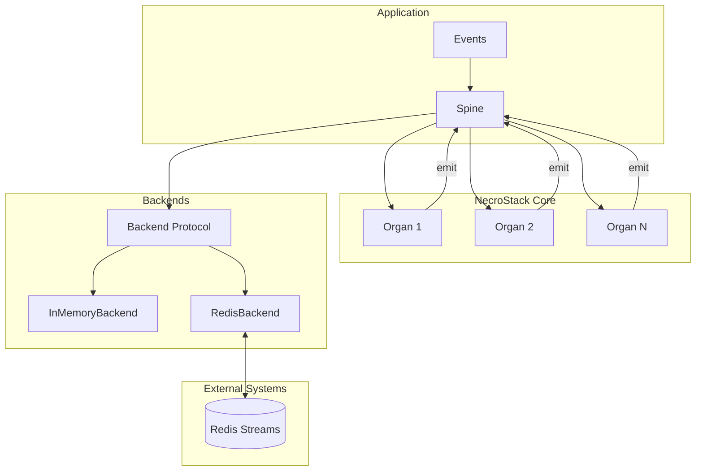

# Design Document — NecroStack

## Overview

NecroStack is a minimal, async-first event-driven micro-framework for Python 3.11+. It revolves around three core abstractions:

Event — an immutable, validated message

Organ — a pluggable event handler

Spine — a dispatcher that routes events to Organs and manages event flow

Backends provide the event queue. Two are supported:

InMemoryBackend — for development/testing

RedisBackend — production durability (MVP-lite)

The framework is designed for clarity, composability, and correctness, while offering enough structure to scale into real applications.

The design prioritizes:
- **Simplicity**: Three core abstractions (Event, Organ, Spine)
- **Async-first**: Native async/await with sync compatibility
- **Pluggability**: Swappable backends and composable Organs
- **Production-minded**: Structured logging, loop protection, reconnection handling

## Architecture



### Event Flow

An Event is added to the backend via enqueue().

The Spine begins a loop and calls backend.pull() to retrieve the next Event.

The Spine identifies all Organs whose listens_to contains event.event_type.

Each matching Organ’s handle() method is invoked (sync or async).

If the handler returns new events, they are enqueued back into the backend.

The loop continues until:

no more events (timeout), or

max_steps is exceeded (safety), or

external stop (future extension).

## Components and Interfaces

### Event (`necrostack/core/event.py`)

```python
from pydantic import BaseModel, Field, field_validator
from datetime import datetime, timezone
from uuid import uuid4, UUID
from typing import Any

class Event(BaseModel):
    """Immutable, validated event message."""

    id: UUID = Field(default_factory=uuid4)
    timestamp: datetime = Field(default_factory=lambda: datetime.now(timezone.utc))
    event_type: str
    payload: dict[str, Any] = Field(default_factory=dict)

    model_config = {
        "extra": "forbid",
        "frozen": True,
    }

    @field_validator("event_type")
    @classmethod
    def validate_event_type(cls, v: str) -> str:
        if not v.strip():
            raise ValueError("event_type must not be empty")
        return v

```

### Organ (`necrostack/core/organ.py`)

```python
from abc import ABC, abstractmethod
from typing import Awaitable, ClassVar
from necrostack.core.event import Event

class Organ(ABC):
    """Base class for event handlers."""

    listens_to: ClassVar[list[str]] = []

    def __init__(self, name: str | None = None):
        self.name = name or self.__class__.__name__

    @abstractmethod
    def handle(
        self,
        event: Event,
    ) -> Event | list[Event] | None | Awaitable[Event | list[Event] | None]:
        ...

```

### Spine (`necrostack/core/spine.py`)

```python
import inspect
import logging
from necrostack.core.event import Event
from necrostack.core.organ import Organ
from necrostack.backends.base import Backend

class Spine:
    """Central event dispatcher."""

    def __init__(self, organs: list[Organ], backend: Backend, max_steps: int = 10_000):
        self.organs = organs
        self.backend = backend
        self.max_steps = max_steps
        self.log = logging.getLogger("necrostack.spine")
        self._validate_organs()

    def _validate_organs(self):
        for organ in self.organs:
            if not isinstance(organ.listens_to, list):
                raise TypeError(f"{organ.name}.listens_to must be a list[str]")
            if any(not isinstance(t, str) for t in organ.listens_to):
                raise TypeError(f"{organ.name}.listens_to must contain only strings")

    async def _invoke_handler(self, organ: Organ, event: Event):
        result = organ.handle(event)
        if inspect.iscoroutine(result):
            return await result
        return result

    async def run(self, start_event: Event | None = None) -> None:
        steps = 0

        if start_event:
            await self.backend.enqueue(start_event)

        while True:
            if steps >= self.max_steps:
                raise RuntimeError("Max steps exceeded")
            steps += 1

            event = await self.backend.pull(timeout=1.0)

            if event is None:
                return

            for organ in self.organs:
                if event.event_type in organ.listens_to:
                    self.log.info(
                        f"Dispatching {event.event_type} to {organ.name}",
                        extra={
                            "event_id": str(event.id),
                            "event_type": event.event_type,
                            "organ": organ.name,
                        },
                    )

                    emitted = await self._invoke_handler(organ, event)

                    if emitted is None:
                        continue

                    if isinstance(emitted, Event):
                        emitted = [emitted]

                    for new_event in emitted:
                        await self.backend.enqueue(new_event)

```

### Backend Protocol (`necrostack/backends/base.py`)

```python
from typing import Protocol
from necrostack.core.event import Event

class Backend(Protocol):
    async def enqueue(self, event: Event) -> None: ...
    async def pull(self, timeout: float = 1.0) -> Event | None: ...
    async def ack(self, event: Event) -> None: ...

```

### InMemoryBackend (`necrostack/backends/inmemory.py`)

```python
import asyncio
from necrostack.core.event import Event

class InMemoryBackend:
    """Async FIFO backend using asyncio.Queue."""

    def __init__(self):
        self._queue: asyncio.Queue[Event] = asyncio.Queue()

    async def enqueue(self, event: Event) -> None:
        await self._queue.put(event)

    async def pull(self, timeout: float = 1.0) -> Event | None:
        try:
            return await asyncio.wait_for(self._queue.get(), timeout)
        except asyncio.TimeoutError:
            return None

    async def ack(self, event: Event) -> None:
        return None  # No durability guarantees

```

### RedisBackend (`necrostack/backends/redis_backend.py`)

```python
import json
from redis.asyncio import Redis
from necrostack.core.event import Event

class RedisBackend:
    """Redis Streams backend (MVP-lite)."""

    def __init__(self, redis_url: str, stream_key: str = "necrostack:events"):
        self.redis_url = redis_url
        self.stream_key = stream_key
        self._redis: Redis | None = None
        self._last_id = "0"

    async def _get_client(self) -> Redis:
        if self._redis is None:
            self._redis = Redis.from_url(self.redis_url)
        return self._redis

    async def enqueue(self, event: Event) -> None:
        redis = await self._get_client()
        await redis.xadd(
            self.stream_key,
            {"event": json.dumps(event.model_dump())}
        )

    async def pull(self, timeout: float = 1.0) -> Event | None:
        redis = await self._get_client()
        resp = await redis.xread(
            streams={self.stream_key: self._last_id},
            count=1,
            block=int(timeout * 1000),
        )

        if not resp:
            return None

        _, messages = resp[0]
        message_id, raw = messages[0]
        self._last_id = message_id

        raw_event = json.loads(raw["event"])
        return Event(**raw_event)

    async def ack(self, event: Event) -> None:
        """No-op in MVP. Phase 2: consumer groups."""
        return None

```

## Data Models

### Event Schema

| Field      | Type           | Description                      |
| ---------- | -------------- | -------------------------------- |
| id         | UUID           | Unique auto-generated identifier |
| timestamp  | datetime (UTC) | Event creation time              |
| event_type | str            | Routing key                      |
| payload    | dict[str, Any] | Domain-specific data             |


### Organ Registration

Organs are registered with Spine at construction time. Spine validates:
- Each organ's `listens_to` is a list of strings
- No duplicate organ names (warning only)

### Logging Format (Structured JSON)

```json
{
  "timestamp": "2024-01-15T10:30:00Z",
  "level": "INFO",
  "event": "dispatch",
  "event_id": "abc-123",
  "event_type": "SUMMON_RITUAL",
  "organ": "SummonSpirit",
  "emitted": ["SPIRIT_APPEARED"]
}
```


## Correctness Properties

*A property is a characteristic or behavior that should hold true across all valid executions of a system—essentially, a formal statement about what the system should do. Properties serve as the bridge between human-readable specifications and machine-verifiable correctness guarantees.*

### Property 1: Event Serialization Round-Trip

*For any* valid Event instance, serializing via `model_dump()` and then reconstructing via `Event(**data)` SHALL produce an equivalent Event with identical field values.

**Validates: Requirements 1.6, 1.7**

### Property 2: Event ID Uniqueness

*For any* collection of Events created without explicit IDs, each Event SHALL have a unique, valid UUID string as its `id` field.

**Validates: Requirements 1.2**

### Property 3: Empty Event Type Rejection

*For any* string that is empty or consists only of whitespace characters, attempting to create an Event with that string as `event_type` SHALL raise a validation error.

**Validates: Requirements 1.4**

### Property 4: Unknown Field Rejection

*For any* Event creation attempt that includes fields not defined in the Event schema, the creation SHALL raise a validation error.

**Validates: Requirements 1.5**

### Property 5: Organ Name Defaulting

*For any* Organ subclass instantiated without an explicit `name` argument, the `name` attribute SHALL equal the class name.

**Validates: Requirements 2.4**

### Property 6: Organ listens_to Validation

*For any* Organ whose `listens_to` attribute contains non-string elements, Spine registration SHALL raise a validation error.

**Validates: Requirements 2.3**

### Property 7: Event Routing Correctness

*For any* Event with a given `event_type` and any set of Organs, the Spine SHALL invoke `handle()` on exactly those Organs whose `listens_to` list contains that `event_type`.

**Validates: Requirements 3.3**

### Property 8: Handler Return Enqueueing

*For any* Organ handler that returns an Event or list of Events, the Spine SHALL enqueue all returned Events to the backend.

**Validates: Requirements 3.5**

### Property 9: Organ Invocation Order

*For any* ordered list of Organs registered with Spine, when multiple Organs match an event type, they SHALL be invoked in their registration order.

**Validates: Requirements 3.6**

### Property 10: Max Steps Enforcement

*For any* Spine configured with `max_steps=N`, if the dispatch loop processes more than N events, the Spine SHALL raise `RuntimeError("Max steps exceeded")`.

**Validates: Requirements 3.7**

### Property 11: Backend FIFO Ordering

*For any* sequence of Events enqueued to InMemoryBackend, pulling events SHALL return them in the same order they were enqueued (FIFO).

**Validates: Requirements 5.2**

### Property 12: Backend Pull Timeout

*For any* empty InMemoryBackend, calling `pull(timeout=T)` SHALL return `None` after approximately T seconds without blocking indefinitely.

**Validates: Requirements 5.3**

### Property 13: Sync and Async Handler Support

*For any* mix of synchronous and asynchronous Organ handlers, the Spine SHALL correctly invoke both types—awaiting async handlers and calling sync handlers directly.

**Validates: Requirements 3.4**

## Error Handling

### Event Validation Errors

- **Empty event_type**: Raises `pydantic.ValidationError` with message indicating event_type must not be empty
- **Unknown fields**: Raises `pydantic.ValidationError` due to `extra="forbid"` configuration
- **Invalid field types**: Raises `pydantic.ValidationError` with type coercion failure details

### Spine Errors

- **Max steps exceeded**: Raises `RuntimeError("Max steps exceeded")` when loop count exceeds `max_steps`
- **Invalid Organ registration**: Raises `TypeError` if `listens_to` contains non-string elements
- **Handler exceptions**: Logged and optionally re-raised (configurable); does not crash the dispatch loop by default

### Backend Errors

- **InMemoryBackend**: No persistent errors; timeout returns `None`
- **RedisBackend**: 
  - Connection failures trigger automatic reconnection attempts
  - Serialization errors raise `ValueError`
  - Redis command failures logged and may raise `redis.RedisError`

  Framework guarantees:

Validation errors bubble from Pydantic

Handler exceptions logged (but don’t kill loop)

Backend errors logged; Redis reconnects automatically

Spine halts on:

max_steps

empty queue timeout

## Testing Strategy

### Property-Based Testing

The project SHALL use **Hypothesis** as the property-based testing library. Each correctness property SHALL be implemented as a Hypothesis test with a minimum of 100 iterations.

Property tests SHALL be annotated with the format:
```python
# **Feature: necrostack-framework, Property N: Property Name**
# **Validates: Requirements X.Y**
```

### Unit Testing

Unit tests SHALL cover:
- Event model instantiation with various field combinations
- Organ subclass creation and registration
- Spine construction and configuration
- Backend method behavior (enqueue, pull, ack)
- Error conditions and edge cases

### Integration Testing

Integration tests SHALL verify:
- Complete Séance demo event chain (SUMMON_RITUAL → printed output)
- Complete ETL demo event chain (ETL_START → printed summary)
- Mixed sync/async Organ pipelines
- Backend swapping (same Organs, different backends)

### Test Organization

```
tests/
├── test_event.py          # Event model tests
├── test_organ.py          # Organ base class tests
├── test_spine.py          # Spine dispatcher tests
├── test_inmemory.py       # InMemoryBackend tests
├── test_redis.py          # RedisBackend tests (requires Redis)
├── test_seance_flow.py    # Séance integration test
└── test_etl_flow.py       # ETL integration test
```

### Test Configuration

```python
# conftest.py
from hypothesis import settings

settings.register_profile("ci", max_examples=100)
settings.register_profile("dev", max_examples=20)
```
